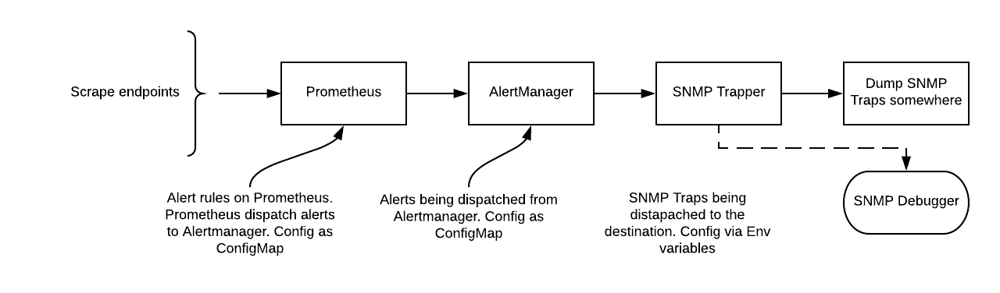

Prometheus WebHook to SNMP-trap forwarder
=========================================

This is a quick (and dirty) way to get Prometheus to send SNMP traps, by mapping AlertManager "Annotations" and "Labels" to generic SNMP OIDs.

Integration with Prometheus
---------------------------
1. Prometheus gathers metrics
2. Prometheus appraises metrics against rules
3. If rules are triggered then alerts are raised through the AlertManager
4. The AlertManager triggers notifications to the webhook_snmptrapper
5. The webhook_snmptrapper forwards alerts as SNMP traps to the configured trap-address

SNMP integration
----------------
The provided MIB (`PROMETHEUS-TRAPPER-MIB.txt`) defines two notifications:
- ***prometheusTrapperFiringNotification***: Notification for an alert that has occured
- ***prometheusTrapperRecoveryNotification***: Notification for an alert that has recovered

The MIB can be loaded into whatever SNMP Trap-server you're using. See [Dockerfile](trapdebug/net-snmp/Dockerfile) for a working demo using net-snmp on Alpine Linux.

### SNMP variables
Both of these traps contain the following variables:
- ***prometheusTrapperNotificationInstance***: The instance or hostname
- ***prometheusTrapperNotificationService***: A name for the service affected
- ***prometheusTrapperNotificationLocation***: The physical location where the alert was generated
- ***prometheusTrapperNotificationSeverity***: The severity of the alert
- ***prometheusTrapperNotificationDescription***: Text description of the alert
- ***prometheusTrapperNotificationTimestamp***: When the alert was first generated

AlertManager configuration
--------------------------
AlertManager needs to be configured to fire webhooks as notifications, with a pre-defined assortment of labels and annotations (these map to the SNMP MIB provided). Each alert should have the following parameters:

### Annotations:
- ***description***: A string describing the alert (_prometheusTrapperNotificationDescription_)

### Labels:
- ***instance***: A string containing a unique host-identifier / hostname / instance-id / IP-address etc (_prometheusTrapperNotificationInstance_)
- ***severity***: A string describing the severity of the alert (_prometheusTrapperNotificationSeverity_)
- ***location***: A string describing the location of the instance(s) / system(s) generating the alert (_prometheusTrapperNotificationLocation_)
- ***service***: A string describing the service affected (_prometheusTrapperNotificationService_)

Command-line flags
------------------
- **-snmpcommunity**: The SNMP community string (_default_ = `public`)
- **-snmpretries**: The number of times to retry sending traps (_default_ = `1`)
- **-snmptrapaddress**: The address to send traps to (_default_ = `127.0.0.1:162`)
- **-webhookaddress**: The address to listen for incoming webhooks on (_default_ = `0.0.0.0:9099`)

### Kubernetes examples:

```
kubectl create -f deploymentes/kubernetes.yaml
kubectl create -f deploymentes/kubernetes-debugger.yaml
```


### Prometheus alert example:
```
prometheus.rules: |
   groups:
   - name: example-rules
     interval: 30s # defaults to global interval
     rules:
     - alert: "Too Many Pods"
       expr: sum(kubelet_running_pod_count) > 5
       labels:
          instance: "occluster.local cluster"
          severity: "s*** s*** stuff is down"
          location: "undefined"
          service: "ocp"
       annotations:
         description: "OMG OMG we are running out of resources"
         miqTarget: "ExtManagementSystem"
         severity: "ERROR"
         url: "https://www.example.com/too_many_pods_fixing_instructions"
         message: "Too many running pods"
```

Test debugger using NC:
```
echo -n "hello" | nc -4u  172.30.58.113 8162
```

### AlertManager configuration example:
```
  alertmanager.yml: |                               
    global:                                         

    # The root route on which each incoming alert enters.                                                
    route:                                          
      # default route if none match                 
      receiver: snmp-trapper                   

      # The labels by which incoming alerts are grouped together. For example,                           
      # multiple alerts coming in for cluster=A and alertname=LatencyHigh would                          
      # be batched into a single group.             
      # TODO:                                       
      group_by: []                                  

      # All the above attributes are inherited by all child routes and can                               
      # overwritten on each.                        

    receivers:                                      
    - name: snmp-trapper                            
      webhook_configs:                              
      - url: http://snmp-trapper:9099 
```

### ToDo:

For SNMP Trapper to be production ready we need:

  1. Introduce some kinf of HA (mesh library potentially so we would not need to deal with quorum/raft)
  2. Add workqueue with rate limiting to the trapper
  3. Abstract snmptrap library via interface.


### Diagram:



### Log output from Trapper and Debugger:

Trapper:
```
time="2018-03-06T16:21:30Z" level=info msg="It's a trap!" logger=SNMP-trapper status=firing vars=[{"Oid": "1.3.6.1.6.3.1.1.4.1.0", "Variable": {"Type": "Oid", "Value": "1.3.6.1.3.1977.1.0.1"}}, {"Oid": "1.3.6.1.3.1977.1.1.7", "Variable": {"Type": "OctetString", "Value": "2018-03-06T16:21:00Z"}}, {"Oid": "1.3.6.1.3.1977.1.1.5", "Variable": {"Type": "OctetString", "Value": "OMG OMG we are running out of resources"}}, {"Oid": "1.3.6.1.3.1977.1.1.1", "Variable": {"Type": "OctetString", "Value": "occluster.local cluster"}}, {"Oid": "1.3.6.1.3.1977.1.1.4", "Variable": {"Type": "OctetString", "Value": "s*** s*** stuff is down"}}, {"Oid": "1.3.6.1.3.1977.1.1.3", "Variable": {"Type": "OctetString", "Value": "undefined"}}, {"Oid": "1.3.6.1.3.1977.1.1.2", "Variable": {"Type": "OctetString", "Value": "ocp"}}, {"Oid": "1.3.6.1.3.1977.1.1.6", "Variable": {"Type": "OctetString", "Value": ""}}] 
```

Debugger:
```
time="2018-03-06T16:59:30Z" level=info msg="Trap variable" OID=".1.3.6.1.3.1977.1.1.6" value= 
time="2018-03-06T16:59:30Z" level=info msg="Trap variable" OID=.1.3.6.1.6.3.1.1.4.1.0 value=.1.3.6.1.3.1977.1.0.1 
time="2018-03-06T16:59:30Z" level=info msg="Trap variable" OID=".1.3.6.1.3.1977.1.1.1" value="occluster.local cluster" 
time="2018-03-06T16:59:30Z" level=info msg="Trap variable" OID=".1.3.6.1.3.1977.1.1.2" value=ocp 
time="2018-03-06T16:59:30Z" level=info msg="Trap variable" OID=".1.3.6.1.3.1977.1.1.3" value=undefined 
time="2018-03-06T16:59:30Z" level=info msg="Trap variable" OID=".1.3.6.1.3.1977.1.1.7" value="2018-03-06T16:59:00Z" 
time="2018-03-06T16:59:30Z" level=info msg="Trap variable" OID=".1.3.6.1.3.1977.1.1.5" value="OMG OMG we are running out of resources" 
time="2018-03-06T16:59:30Z" level=info msg="Trap variable" OID=".1.3.6.1.3.1977.1.1.4" value="s*** s*** stuff is down" 
```